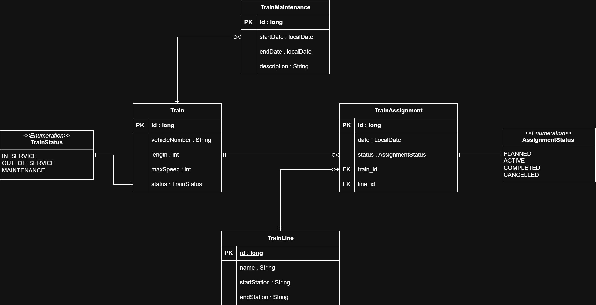

# Projektdokumentation  
## Train Fleet Manager  
**Modul:** M294/M295\
**Name:** Marvin Strasser  
**Datum:** 14 Februar 2026  

---

## Inhaltsverzeichnis

1. Projektidee  
2. Anforderungsanalyse  
   2.1 User Stories  
   2.2 Akzeptanzkriterien  
3. Klassendiagramm  
4. Storyboard der Applikation  
5. REST-Schnittstellen (Überblick)  
6. Testplan (manuelles Testen)  
7. Testergebnisse  
8. Installationsanleitung  
---

## 1. Projektidee

Der Train Fleet Manager ist eine REST-basierte Applikation zur Verwaltung einer Zugflotte im Eisenbahnverkehr. Die Applikation bildet einen realistischen betrieblichen Prozess ab, bei dem Züge erfasst, deren Betriebsstatus verwaltet und bei Bedarf bestimmten Zuglinien zugewiesen werden.

Ein Zug kann sich entweder im regulären Betrieb (**IN_SERVICE**), in Wartung (**MAINTENANCE**) oder ausser Betrieb (**OUT_OF_SERVICE**) befinden. Befindet sich ein Zug im Betrieb, kann er einer Linie (z. B. *IR36 Zürich HB - Basel SBB*) zugewiesen werden. Während einer Wartung ist keine Linienzuweisung möglich.

Die Applikation stellt für alle relevanten Entitäten CRUD-Operationen über eine REST-API zur Verfügung. Die Daten werden persistent in einer relationalen Datenbank gespeichert. Ziel des Projekts ist eine saubere, stabile und verständliche Umsetzung gemäss den Anforderungen des Moduls M295.

---

## 2. Anforderungsanalyse

### 2.1 User Stories

**User Story 1 - Zug erfassen**  
Als Mitarbeiter vom Fleet Management möchte ich einen neuen Zug erfassen können, damit dieser im System verwaltet werden kann.

**User Story 2 - Zug einer Linie zuweisen**  
Als Disponent möchte ich einen Zug einer Linie zuweisen können, damit ersichtlich ist, auf welcher Strecke er eingesetzt wird.

**User Story 3 - Zug in Wartung setzen**  
Als Disponent bei der Instandhaltung möchte ich einen Zug in Wartung setzen können, damit klar ist, dass dieser aktuell keiner Linie zugewiesen ist.

---

### 2.2 Akzeptanzkriterien

**User Story 1**
- Ein Zug kann mit Betriebsnummer, Höchstgeschwindigkeit, Länge und Status erstellt werden
- Die Betriebsnummer ist eindeutig

**User Story 2**
- Ein Zug kann nur einer Linie zugewiesen werden, wenn er den Status **IN_SERVICE** besitzt
- Ein Zug kann maximal eine aktive Zuweisung haben

**User Story 3**
- Wird ein Zug auf **MAINTENANCE** gesetzt, kann er keiner Linie zugewiesen werden
- Der Status des Zuges ist korrekt über die API abrufbar

---

## 3. Klassendiagramm



---

## 4. Storyboard der Applikation

1. Ein Zug wird im System erfasst
2. Eine oder mehrere Linien werden erfasst
3. Ein Zug wird einer Linie zugewiesen (Assignment)
4. Der aktuelle Status eines Zuges wird abgefragt
5. Der Zug wird in Wartung gesetzt, wodurch die Linienzuweisung blockiert wird

Dieses Storyboard bildet den zentralen Ablauf der Applikation ab.

---

## 5. REST-Schnittstellen (Überblick)

### Train
- `POST /trains`
- `GET /trains`
- `GET /trains/number/{vehicleNumber}`
- `GET /trains/number/{vehicleNumber}/status`
- `PUT /trains/number/{vehicleNumber}/status`
- `DELETE /trains/number/{vehicleNumber}`

### TrainLine
- `POST /lines`
- `GET /lines`
- `DELETE /lines/{id}`

### TrainAssignment
- `POST /assignments`
- `GET /assignments`
- `GET /assignments/train/{vehicleNumber}`
- `GET /assignments/line/{lineId}`
- `DELETE /assignments/{id}`

---

## 6. Testplan

| Nr. | Testfall | Beschreibung | Erwartetes Resultat |
|---|---|---|---|
| 1 | Zug erfassen | Neuer Zug wird erstellt | Zug wird gespeichert |
| 2 | Linie erfassen | Neue Linie wird erstellt | Linie wird gespeichert |
| 3 | Assignment erstellen | Zug wird Linie zugewiesen | Assignment erfolgreich |
| 4 | Wartung setzen | Zugstatus ändern | Keine Linienzuweisung möglich |
| 5 | Status abfragen | Status inkl. Linie abrufen | Korrekte Ausgabe |

---

## 7. Testergebnisse

Alle definierten Testfälle wurden manuell mit Postman durchgeführt.

- Alle POST-, GET-, PUT- und DELETE-Operationen funktionierten wie erwartet
- Die Applikation stürzte nicht ab
- Fehlersituationen wurden sauber behandelt

---

## 8. Installationsanleitung

### Backend (Spring Boot)
!!!Port 3306 muss zwingend frei sein!!!
1. Build & Start
   ```bash
   docker compose up -d
   ```
2. API: http://localhost:8080

### Frontend
1. In das Frontend wechseln
   ```bash
   cd frontend
   ```
2. Abhängigkeiten installieren
   ```bash
   npm install
   ```
3. Dev-Server starten (nutzt Proxy auf Backend `http://localhost:8080`)
   ```bash
   npm run dev
   ```
   Läuft standardmässig auf http://localhost:5173.

